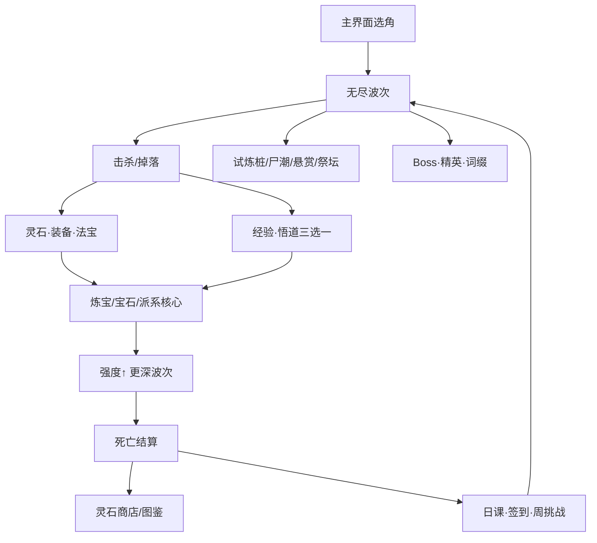

# 《玄天劫》玩法与逻辑识别 + 十轮产品左右互搏

> 主持：小米高级游戏产品经理  
> 参与：产品 · 玩法策划 · 数值 · 运营/增长 · 体验设计（5 席）  
> 方式：每轮 **甲方（主张） vs 乙方（拆台）** 对辩 → 记录共识/分歧  
> 产出：玩法层优化清单（文末）  
> 基线：**v7.8.14** 线上 H5 割草（Canvas2D）

---

# 一、玩法与逻辑识别（会前底稿）

## 1.1 一句话
**无尽妖潮幸存者**：自动攻击 + 走位躲技能 + 局内 Build（配装/宝石/法门）+ 局外轻养成（灵石/商店/签到/日课/周挑战）。

## 1.2 系统地图

| 层 | 系统 | 逻辑要点 |
|----|------|----------|
| 操作 | 虚拟摇杆 + 2 技能 | 剑气扇形 / 御风瞬步无敌帧 |
| 战斗 | 自动飞剑/环绕 + 解锁武器 | 派系装备点亮武器、觉醒、双兵合击 |
| 成长 | 悟道三选一 + 装备词缀 | 派系纯度、灵石槽、共鸣 |
| 压力 | 波次/尸潮/词缀/Boss | 终局压力曲线、前 3 波容错 |
| 事件 | 试炼、悬赏、祭坛血契 | 信息型 DPS 对账 / 限时挑战 / 赌注 |
| 高光 | 自动必杀·三幕天劫 | 充能清屏；幕切换回血 |
| 回访 | 签到/日课/周挑战 | 灵石激励 |
| 商业 | IAA mock + 去广告 | 自愿激励位 |
| 表现 | 精灵动画/碰撞/特效 | 代入感与打击感 |

## 1.3 核心循环合同
玩家 **走位** 以 **存活并清潮**，在 **妖群压力** 下冒险；成功给 **Build 与高光**，失败 **结算并再战**。

## 1.4 当前体验分层
| 时间 | 玩家感受到 |
|------|------------|
| 0–30s | 会走、会割、第一波爽 |
| 1–5min | 配装/宝石方向；试炼/尸潮事件 |
| 5–15min | 合击/必杀/三幕；开始趋同或腻 |
| 死亡后 | 灵石、日课、是否想再打 |

---

# 二、十轮左右互搏

## R1 · 核心幻想：「修真割草」立得住吗？

| 甲方（立） | 乙方（破） |
|------------|------------|
| 御剑+妖潮+渡劫，幻想完整；割草密度是体感主旋律 | 「修真」更多是皮：Build 主要靠装备词缀，修真味靠命名；易被指「幸存者换皮」 |
| 比纯射击幸存者更有收集欲（图鉴/法宝） | 系统多但叙事薄：为什么打妖、劫从何来未进玩法 |

**共识**：幻想可立，但要用**玩法事件**加深「渡劫/悟道」，不能只靠文案。  
**分歧**：是否需要轻剧情开场——运营侧要，玩法侧怕拖节奏。

---

## R2 · 前 30 秒是否达标？

| 甲方 | 乙方 |
|------|------|
| 自动攻击+走位，零学习；已有 v7.7 教程四步 | 教程讲装备合成/灵石槽，信息过载；首波只感知「在动」，不知 Build 要什么 |
| 主界面 CTA 置顶，进局快 | 开始页仍密（签到壳条/商店/图鉴），选择噪音 |

**共识**：开局可玩，但**目标感**弱于「可操作」。  
**优化倾向**：首 60 秒「单一承诺」——只强调「割潮涨灵石」，第二分钟再引入炼宝。

---

## R3 · 割草爽感是否够「主旋律」？

| 甲方 | 乙方 |
|------|------|
| 尸潮、连锁、必杀清屏、hit-stop，密度与高潮在 | 武器视觉同质；中局「躲」多于「割」，怪堆成墙时是折磨不是爽 |
| 必杀是可预期高光 | 必杀自动放，玩家「观赏」多于「决策」 |

**共识**：爽感框架有，**决策型爽感**不足。  
**争议点**：必杀是否改为「可点可自动」双模式。

---

## R4 · Build 深度：配装是否带来「这局不一样」？

| 甲方 | 乙方 |
|------|------|
| 派系 9 系 × 宝石三阶 × 核心 × 共鸣 × 法门，理论组合爆炸 | 实际中局掉什么用什么；「纯度」门槛高，流派觉醒难触发；双修/专精有理论分流，体感趋同 |
| 装备词缀带技能，build 有形态差异 | 词缀池对玩家不透明，「为什么这局不一样」说不清 |

**共识**：**深度过载、表达不足**。  
**优化倾向**：做「Build 一句话」HUD（如「赤锋·剑罡 3/5」），并保证 5 分钟内至少 1 次质变节点。

---

## R5 · 事件节奏：试炼/尸潮/悬赏是否加分？

| 甲方 | 乙方 |
|------|------|
| 试炼 DPS 对账、尸潮奖励、悬赏给「下一目标」 | 事件打断割草；试炼 60s 易无聊；悬赏与自动武器抢注意力 |
| 三幕天劫给了章节感 | 幕与试炼/尸潮撞车时信息过载 |

**共识**：事件该有，但要**降频、变短、与幕同步**。  
**优化倾向**：试炼 60s→45s 或打碎即走；尸潮与试炼不同周内互斥。

---

## R6 · 操作上限：只有走位吗？

| 甲方 | 乙方 |
|------|------|
| 走位+瞬步无敌帧+剑气时机，手机单手合理 | 「能秀」窗口少；碰撞分离后可「顶着走」，又削弱走位严肃性 |
| 必杀/合击自动，降低操作负担 | 核心玩家会说「挂机也能玩到 15 波」 |

**共识**：休闲定位可接受，但需**自愿挑战层**（不是强制微操）。  
**优化倾向**：精英前摇技（可躲）+ 高难「天劫场」可选开关。

---

## R7 · 长局 15–25 分钟是否无聊？

| 甲方 | 乙方 |
|------|------|
| 三幕+必杀+试炼切段落 | 20 波后数值成长减速，怪变多变硬，操作重复；容易「不是死，是腻」 |
| 终局压力已上调 | 压力若只加血防，会变成 spongy，更无聊 |

**共识**：要 **新机制事件** 而非纯数值膨胀。  
**优化倾向**：每 5 波「变体规则」（反伤潮/加速潮/宝箱雨）轮换。

---

## R8 · 死亡与再战：有没有「再来一把」？

| 甲方 | 乙方 |
|------|------|
| 结算有灵石/日课/周挑战；商店有长线 | 死亡叙事弱（只有数字）；不知「差在哪」 |
| 可分享战绩卡 | 分享动机弱（无对比、无炫耀帧） |

**共识**：再战钩有经济，缺**情绪**与**社交对比**。  
**优化倾向**：死亡「本局故事句」+ 超越好友/自己上周纪录的彩带。

---

## R9 · 回访与商业化是否伤玩法？

| 甲方 | 乙方 |
|------|------|
| 签到/日课轻；IAA 自愿 | 日课三条偏「任务感」；广告翻倍诱导「打完就想点」，中度打断 |
| 周挑战单目标清晰 | 一周只有一个目标，周三就腻 |

**共识**：不伤核心，但周挑战**太薄**；IAA 位置合格。  
**优化倾向**：周挑战 1+2 小目标；赛季进度条挂在周挑战上。

---

## R10 · 如果只能改三件事，改什么？（决策轮）

| 甲方提案 | 乙方拆台 | 裁决 |
|----------|----------|------|
| A. 加 20 种新武器 | 加内容不解决趋同 | **否** |
| B. 必杀改手动蓄力释放 | 自动高光已好，手动增加负担 | **否**（改为「可存 1 次手动点」） |
| C. **Build 表达层**（流派进度+质变提示） | 工作量可控、直击「这局不一样」 | **是·P0** |
| D. **波次变体规则**（每 5 波 modifier） | 直击 20 波无聊 | **是·P0** |
| E. **精英前摇技** | 给走位意义 | **是·P1** |
| F. 死亡故事+纪录对比 | 再战情绪 | **P1** |
| G. 周挑战 1+2 | 回访厚度 | **P2** |

**十轮结论**：产品问题不在「不够多」，而在 **表达、段落、决策型爽感** 三缺。

---

# 三、玩法优化清单（收敛）

## P0（直接提升「好玩」）
1. **Build 表达层**  
   - HUD 显示当前流派：`赤锋·剑罡 3/5`  
   - 质变节点大字报（觉醒/合击/核心）+「为何强」一句话  
   - 目标：5 分钟内至少 1 次可感知质变  

2. **波次变体（每 5 波）**  
   - 如：潮涌（密度+）/ 妖甲（物抗）/ 疾风（加速）/ 宝箱雨（掉落+）  
   - 规则 5s 前预警；与三幕标签共存  

3. **必杀「存弹」**  
   - 自动放改为：蓄满后**可长按图标立即放**，否则 3s 后自动；保留 1 次「手动优先」感  

## P1（操作与情绪）
4. **精英/Boss 前摇技**  
   - 砸地圈、冲撞线、扇形息；预警 ≥0.6s；奖励闪避成功短暂易伤  

5. **死亡叙事 + 纪录对比**  
   - 「道消于第 X 波·被围/被砸」  
   - 与本机最佳/上周对比彩带  

6. **试炼 45s + 打碎即走**（降负）

## P2（回访）
7. **周挑战 1 主 + 2 小**（如连杀/波次/开箱）  
8. **赛季进度条**（灵石+挑战积分，纯展示即可）

## 明确不做（本阶段）
- 再堆 10 种武器（解决不了趋同）  
- 强制手动必杀  
- 重数值无事件的「更肉的怪」

---

# 四、北极星与验证

| 优化 | 预期指标变化 |
|------|----------------|
| Build 表达 | 中局退出率↓，截图分享↑ |
| 波次变体 | 平均波次↑，20 波后退出↓ |
| 前摇技 | 平均存活↓但再战率↑（有「我能躲」） |
| 死亡叙事 | 日再战次数↑ |

---

# 五、会议纪要（执行向）

| 轮次 | 主题 | 共识 |
|------|------|------|
| R1 | 幻想 | 玩法事件加深修真，不只文案 |
| R2 | 前 30 秒 | 先承诺「割潮」，再教系统 |
| R3 | 割草爽 | 要决策型爽感 |
| R4 | Build | 深度过载、表达不足 → HUD 流派 |
| R5 | 事件 | 降频变短，与幕同步 |
| R6 | 操作 | 自愿挑战，不强制微操 |
| R7 | 长局 | 变体规则 > 加血防 |
| R8 | 再战 | 补情绪与对比 |
| R9 | 回访/商业 | 周挑战加厚；IAA 保持自愿 |
| R10 | 只改三件 | Build 表达 / 波次变体 / 必杀存弹 |

**最终裁决（PM）**：下迭代只做 **P0 三项**，用数据决定是否开 P1 前摇技。
